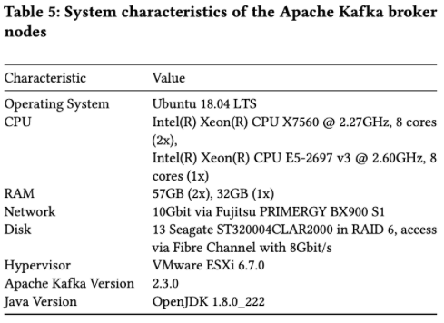
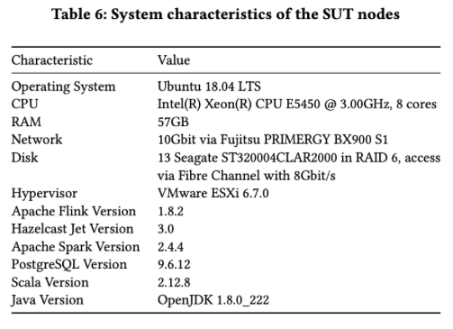

## Setup and Execution of ESPBench - Detailed Instructions

In the following, we explain the setup of the experimental evaluation presented in
the paper _ESPBench: The Enterprise Stream Processing Benchmark_ published at ICPE 2021.

### Server Characteristics
We used 8 virtual machines for the evaluation, each one equipped with __Ubuntu 18.04 LTS__ as OS.
Their purpose is described in the following:
- \#1:  only used for invoking the ansible script/starting the benchmark process
- \#2-4: Apache Kafka cluster:

- \#5-8: System Under Test (SUT) nodes
    - \#5-7: DSPS nodes (Apache Spark, Apache Flink, Hazelcast Jet)
    - \#8: DBMS (PostgreSQL) node
    

### Server Setup

Please find instructions for setting up the servers in the following:

#### 1. General
##### &nbsp;&nbsp;&nbsp; a. Create a user `benchmarker` on all involved machines that has sudo access
  
`sudo adduser benchmarker`

In case you get the error `passwd: Module is unknown`, execute the following: 
`sudo apt install libpam-cracklib`
##### &nbsp;&nbsp;&nbsp; b. Ensure that this user can connect to all machines via ssh w/o password, e.g., through adding the ssh public key to the `authorized_keys` files
- Connect to the first server and generate ssh keys through executing the following command as user `benchmarker`: `ssh-keygen`
- Append the content of `~/.ssh/id_rsa.pub` to the file `/home/benchmarker/.ssh/authorized_keys` on all servers
- Repeat the upper two steps for all servers 
- Verify that you are now able to connect via ssh from any server to any other server w/o the need to enter

- On the first server, create the directory `Benchmarks` in the home directory of the user `benchmarker` and clone the repository into this folder:
  `git clone https://github.com/guenter-hesse/ESPBench.git`
- Change to the cloned repository directory and build the project using `sbt assembly` - if necessary, 
install `scala` and `sbt` first according to https://www.scala-lang.org/download/ and https://www.scala-sbt.org/1.x/docs/Installing-sbt-on-Linux.html , respectively.

#### 2. Apache Kafka
- Connect to the Apache Kafka servers and execute the following steps on each of the three Apache Kafka servers
  to install Apache ZooKeeper™ and Apache Kafka
- Install and configure Apache ZooKeeper™ as described in https://linuxconfig.org/how-to-install-and-configure-zookeeper-in-ubuntu-18-04
- Download Apache Kafka from https://kafka.apache.org/downloads, e.g., via 
`wget https://archive.apache.org/dist/kafka/2.3.0/kafka_2.11-2.3.0.tgz`
- Unpack the downloaded file and move it to the `/opt/` directory:
  - `tar -xzf kafka_2.11-2.3.0.tgz`
  - `mv kafka_2.11-2.3.0 kafka && mv kafka /opt/`  
  - Copy the Apache Kafka configuration files from the benchmark repository directory `tools/configurations` 
    to `/opt/kafka/config/`
- Make Apache Kafka a service:
    - Run `sudo apt install policykit-1`
    - Copy `tools/configuration/kafka/etc/init.d/kafka` from the benchmark repository to `/etc/init.d/` on the Apache Kafka servers
    - Run `update-rc.d kafka defaults`

#### 3. System Under Test

##### &nbsp;&nbsp;&nbsp; a. DBMS - PostgreSQL
Install `PostgreSQL` on the DBMS server (you can use another DBMS, however, that requires some adaptions in the tools), e.g., via 
`sudo apt install postgresql-9.6`

##### &nbsp;&nbsp;&nbsp; a. DSPS 
The steps for installing the DSPS are very similar to those above for installing Apache Kafka. 
- Apache Flink
  - Go to the DSPS servers and download Apache Flink from https://flink.apache.org/downloads.html 
  - Unpack the downloaded archive using the `tar -xzf` command
  - (Re)name the directory `flink` and move it to `/opt/` 
  - Copy the Apache Flink configuration files from the benchmark repository directory `tools/configurations`
    to `/opt/flink/conf/`
- Apache Spark Streaming
  - Go to the DSPS servers and download Apache Flink from https://flink.apache.org/downloads.html
  - Unpack the downloaded archive using the `tar -xzf` command
  - (Re)name the directory `flink` and move it to `/opt/`
  - Copy the Apache Flink configuration files from the benchmark repository directory `tools/configurations`
      to `/opt/flink/conf/`
- Hazelcast Jet
  - Go to the DSPS servers and download Hazelcast Jet from https://jet-start.sh/download
  - Unpack the downloaded archive using the `tar -xzf` command
  - (Re)name the directory `hazelcast-jet` and move it to `/opt/`
  - Copy the Hazelcast Jet configuration files from the benchmark repository directory `tools/configurations`
      to `/opt/spark/config/`

### Benchmark Execution

There are multiple configuration files provided by ESPBench, which need to be adapted 
according to specific environments and wishes. 
The parts that require adaptions in the ESPBench repository, which is cloned to the first node,
are explained in the following:

###### tools/commons/commons.conf
- Define the Apache Kafka topic prefix and the benchmark run number, which will have an impact on the Apache Kafka topic names that are going to be created by the ansible scripts
- Define the query you want to execute (config name for each query is included in the file)
- Define the sending interval, which determines the pause between sending two records - a pause of, e.g., 1,000,000ns would result in an input rate of 1,000 records/s
- Define the benchmark duration
- Define the Apache Kafka bootstrap servers and zookeeper servers

###### tools/datasender
- Input data is taken from DEBS 2012 Grand Challenge, which can be downloaded from [ftp://ftp.mi.fu-berlin.de/pub/debs2012/](ftp://ftp.mi.fu-berlin.de/pub/debs2012/)
- This data file needs to be converted using the `dos2unix` command, and duplicated, so that there are two input files.
- The two files need to be extended by a machine ID using the following commands (adapt file names):
    - First file: `awk 'BEGIN { FS = OFS = "\t" } { $(NF+1) = 1; print $0 }' input1.csv >
      output1.csv`
    - Second file: `awk 'BEGIN { FS = OFS = "\t" } { $(NF+1) = 2; print $0 }' input2.csv >
      output2.csv`
- A third input file is `production_times.csv`, which is generated by the TPC-C data generator that is part of this project.
- The file `datasender.conf` contains Apache Kafka producer configs and the location of the input data files.
- The file `src/main/resources/application.conf` needs the correct DBMS configuration.

###### tools/tpc-c_gen
The `tpc-c.properties` file contains the default setting WRT the number of warehouses and the data output directory. Changes of the output directory require according adaptions in ansible scripts.

###### tools/validator
The file `src/main/resources/application.conf` needs the correct DBMS configuration.

###### Example Implementation - implementation/beam
If you want to use the example implementation, you need to adapt at least two files accordingly:
- `implementation/beam/src/main/resources/beam.properties`
- The `beamRunner` variable in `build.sbt`

###### tools/configuration
- Adapt the `group_vars/all` files if needed
- The directories `plays` and `roles` contain several ansible files, which can be adapted if needed.
- The `hosts` file needs to be edited, i.e, the servers' IP addresses need to be entered
- To finally run the benchmark after doing all the steps above
  - Change to the `tools/configuration` directory 
  - Start the benchmark process via `ansible-playbook -vvvv plays/benchmark-runner-beam.yml` for 
    if you want to use the example implementations provided by ESPBench. 
    The number of `v` define the level of verbosity
